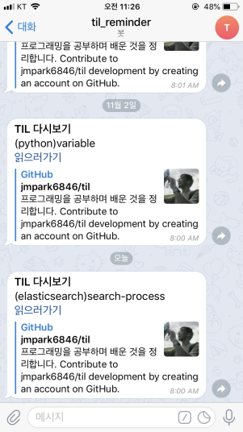

# Today I Learned 리마인더
AWS Lambda와 Chalice, Telegram API를 활용한 TIL 리마인더    
TIL 리마인더는 [TIL 저장소](https://github.com/jmpark6846/til)에 있는 토막지식들을 매일 1개씩 무작위로 골라 Telegram 봇(@til_reminder)로 메세지를 보냅니다.

## 주요 구조 설명
- app.py: Chalice의 주요 실행 파일입니다. 
- chalicelib/ : Chalice 앱에서 사용되는 환경설정 파일을 담는 곳입니다. Github 계정 정보, 텔레그램 봇 토큰 등이 저장됩니다.
- vendor/ : 배포 시 자동으로 빌드되지 않는 파이썬 패키지들을 직접 whl 파일로 만들어 저장합니다.

## 작동 순서
1. Github 로그인
2. 저장소에서 무작위로 마크다운 파일 고르기
3. 메세지 내용 생성
4. 텔레그램 봇으로 메세지 전송
 

## 개발환경
- Python 3.6.5
- Chalice 1.6
- PyGithub 1.43.2
- python-telegram-bot 11.1.0
- Windows 10
